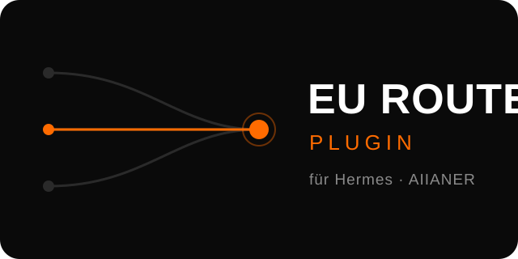

<p align="center">
  
</p>

<h1 align="center">Hermes EU-Router-Plugin</h1>

<p align="center"><strong>Wähle in Hermes deine EU-Compliance-Routen statt roher Modelle.</strong></p>

<p align="center">
  <a href="#lizenz"></a>
  
  
  <a href="https://community.aiianer.de"></a>
</p>

---

## Was ist das Hermes EU-Router-Plugin?

Das Plugin bindet [EU Router](https://www.eurouter.ai/) als Provider in Hermes ein und zeigt im Modell-Picker deine konfigurierten **Routing Rules** ("EU Compliance", …) statt der 130+ rohen Katalog-Modelle, von denen die meisten ohne passende Regel sowieso mit einem Fehler enden. Es ist für alle, die ihre KI-Anfragen DSGVO-konform über EU-Infrastruktur routen wollen, ohne bei jedem Chat an Modell-IDs zu denken. Und es ist update-sicher gebaut: Es lebt am offiziellen User-Plugin-Ort außerhalb des Hermes-Checkouts und überlebt die täglichen Hermes-Updates.

**Teil des AIIANER-Ökosystems:** Das EU-Router-Plugin ist eine Erweiterung für
[Hermes](https://aiianer.de), das modellagnostische, DSGVO-konforme
KI-Betriebssystem. Jedes Open-Source-Tool ist eine Erweiterung für dein
KI-Betriebssystem.

## Features

- **Routen statt Modelle** — der Picker zeigt deine EU-Router-Routing-Rules beim Namen; das Plugin löst die Auswahl automatisch in das gebundene Modell plus `rule_id` auf
- **Update-sicher** — lebt unter `~/.hermes/plugins/model-providers/` (offizieller User-Plugin-Ort), hängt nur am dokumentierten Plugin-Vertrag und degradiert bei API-Drift kontrolliert statt zu crashen
- **Laute Diagnose** — jede Degradation landet mit exakter Ursache in `~/.hermes/logs/eurouter-plugin.log`; der optionale Shim prüft nach jedem Hermes-Update den Endzustand und meldet Brüche sofort

## Architektur

```
┌─────────────────────┐     ┌──────────────────────────────┐
│  Hermes Modell-     │     │  eurouter-Plugin             │
│  Picker             │────▶│  fetch_models()              │
│  "EU Compliance 2"  │     │  → Routing Rules per API     │
└─────────────────────┘     └──────────────┬───────────────┘
                                           │
                            ┌──────────────▼───────────────┐
                            │  build_api_kwargs_extras()   │
                            │  Route → gebundenes Modell   │
                            │  + rule_id in extra_body     │
                            └──────────────┬───────────────┘
                                           │
                            ┌──────────────▼───────────────┐
                            │  api.eurouter.ai             │
                            │  EU-Provider (z. B. Lyceum)  │
                            └──────────────────────────────┘
```

1. **Picker-Schicht:** `fetch_models()` holt deine aktivierten Routing Rules und zeigt sie beim Namen (Leerzeichen werden für Hermes zu Bindestrichen, die UI zeigt sie trotzdem mit Leerzeichen an).
2. **Request-Schicht:** Beim Senden löst das Plugin die gewählte Route auf, schreibt das echte gebundene Modell in den Request und hängt die `rule_id` an, damit EU Router serverseitig nach deiner Regel routet.
3. **Provider-Schicht:** EU Router führt den Request auf EU-Infrastruktur beim Provider aus, den deine Regel vorgibt.

## Setup

```bash
# 1. Repo klonen
git clone https://github.com/oliverhees/hermes-eurouter-plugin.git
cd hermes-eurouter-plugin

# 2. Plugin installieren (kopiert nach ~/.hermes/plugins/model-providers/
#    und leert den Modell-Listen-Cache)
./install.sh

# 3. EU-Router-API-Key hinterlegen (https://www.eurouter.ai/ → API Keys)
#    in ~/.hermes/.env eintragen:
#    EUROUTER_API_KEY=eur_dein_key

# 4. Hermes komplett neu starten — fertig.
#    Der Provider "EU Router" erscheint im Modell-Picker mit deinen Routen.
```

Optional, für maximale Robustheit (Self-Heal + Healthcheck nach jedem Hermes-Update):

```bash
./install.sh --with-shim
```

## Deployment

Läuft überall dort, wo Hermes läuft. Empfohlener Weg für dein Hermes-Setup: **Coolify** auf einem kleinen Linux-VPS.

| Pfad | Wann nehmen | Doc |
| --- | --- | --- |
| **install.sh** | Standard: lokale Hermes-Desktop- oder CLI-Installation | [docs/DEPLOY.md](docs/DEPLOY.md) |

> 🎓 **Schritt-für-Schritt-Tutorials, Setups und Support** gibt es exklusiv in der
> [AIIANER Community](https://community.aiianer.de) — inklusive KI-Coach, der
> deine Fragen zu diesem Tool direkt beantwortet.

> 🛠️ **Du willst es nicht selbst aufsetzen?** Wir übernehmen das für dich:
> Server aufsetzen, Installation, Konfiguration — komplett einsatzbereit,
> auf Wunsch mit Wartungs- & Supportvertrag. Anfrage an **support@aiianer.de**
> oder direkt in der [AIIANER Community](https://community.aiianer.de).

## Status

Funktioniert und live verifiziert:

- Routing Rules erscheinen als Picker-Einträge und lassen sich auswählen
- Auswahl wird korrekt in gebundenes Modell + `rule_id` aufgelöst (echter End-to-End-Call gegen die EU-Router-API getestet)
- Überlebt Hermes-Updates: hängt nur am offiziellen Plugin-Vertrag, alle internen Integrationen degradieren kontrolliert und loggen laut
- Fallbacks: ohne konfigurierte Regeln zeigt der Picker den generischen Katalog; bei hängendem Rules-Endpoint die letzte bekannte Routen-Liste

Offen: Der Healthcheck-Shim greift nur bei Starts über den `hermes`-Befehl im Terminal (die Desktop-App spawnt ihr Backend direkt). Da die Robustheit im Plugin selbst steckt, ist das in der Praxis unkritisch; eine tiefere Integration ist angedacht.

---

## 🌍 Das AIIANER-Universum

| | |
| --- | --- |
| 🏠 **Community** | [community.aiianer.de](https://community.aiianer.de) — Kurse, Labs, Tutorials, KI-Coaches |
| 📺 **YouTube** | [youtube.com/@aiianer](https://www.youtube.com/@aiianer) — Tools, Tests, Deep-Dives |
| 🧠 **Lokyy Brain** | [github.com/oliverhees/lokyy-brain](https://github.com/oliverhees/lokyy-brain) — dein Second Brain, selbst gehostet |
| 🔒 **Datenschleuse** | DSGVO-Filter für deine KI — Tutorials in der Community |
| 📡 **Sichtradar** | [sichtradar.de](https://sichtradar.de) — empfiehlt die KI dich oder deine Konkurrenz? |
| 🤖 **Lokyy** | [lokyy.de](https://lokyy.de) — KI-Apps & Werkzeuge |

## Lizenz

Das Hermes EU-Router-Plugin ist **dual lizenziert**:

1. **AGPL-3.0** — für private Nutzung, Selbsthoster, Forschung und alle
   Projekte, die ihre Änderungen ebenfalls unter AGPL-3.0 offenlegen.
   Siehe [LICENSE](LICENSE).
2. **Kommerzielle Lizenz** — wer das Plugin in geschlossenen, kommerziellen
   Produkten oder Diensten einsetzen will, ohne eigenen Quellcode offenzulegen,
   benötigt eine kommerzielle Lizenz. Details in [LICENSING.md](LICENSING.md),
   Anfragen über die [AIIANER Community](https://community.aiianer.de) oder
   **support@aiianer.de**.

**Wartung, Support & Anpassungen** gibt es als Vertrag direkt vom Entwickler —
Details in [LICENSING.md](LICENSING.md).

## Sicherheit

Sicherheitslücken bitte **nicht** als öffentliches Issue melden.
Verantwortungsvolle Meldung: siehe [SECURITY.md](SECURITY.md).

## Marken

„AIIANER", „Hermes", „Lokyy", „Lokyy Brain", „Datenschleuse" und „Sichtradar"
sind Kennzeichen von Oliver Hees aka Aiianer. Die Lizenz des Quellcodes gewährt
**keine** Rechte an diesen Namen oder Logos. Forks müssen unter eigenem Namen
auftreten. „EU Router" / eurouter.ai ist ein Angebot des jeweiligen Betreibers;
dieses Plugin ist ein unabhängiges Community-Projekt und steht in keiner
offiziellen Verbindung zu eurouter.ai.

---

<p align="center">
  © 2026 <strong>Oliver Hees aka Aiianer</strong> ·
  <a href="https://aiianer.de">aiianer.de</a> ·
  Made with 🖤 im AIIANER-Universum
</p>
